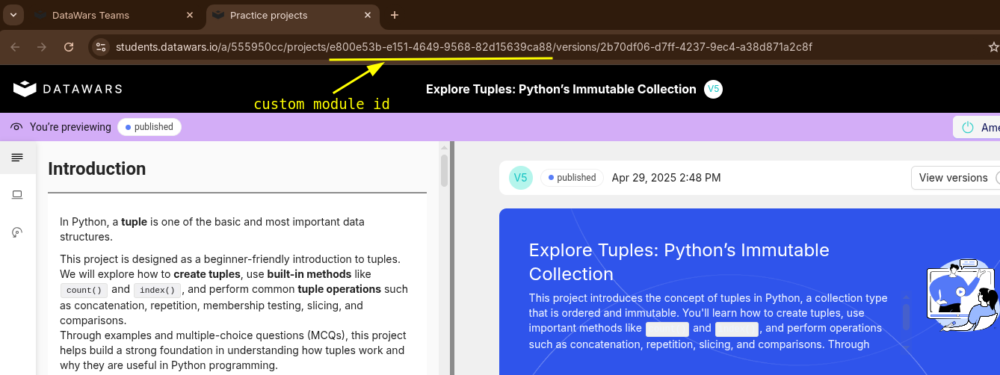
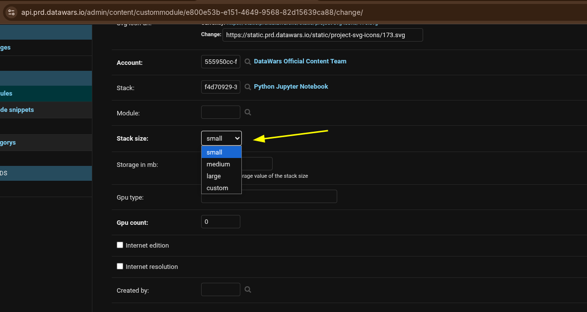

## How to Update Box Size in the Datawars Teams Platform ?

To update the box size for a custom module in the Datawars Teams platform, follow these steps:

1. **Identify the Custom Module ID**  
   Locate the ID of the custom module you want to update.
   

2. **Access the Django Admin Panel**  
   Open the following URL in your browser, replacing `{custom_module_id}` with the actual module ID:  
   ```
   https://api.prd.datawars.io/admin/content/custommodule/{custom_module_id}
   ```

3. **Update the Box Size**  
   - Scroll down to find the **`Stack size`** field.
   - Update the value of this field, and save the changes.
   - 💡 **Tip:** Set the box size to the smallest possible value that meets your needs.
    