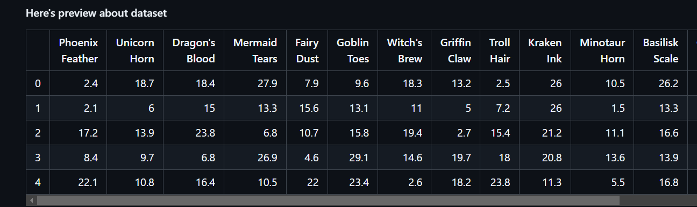
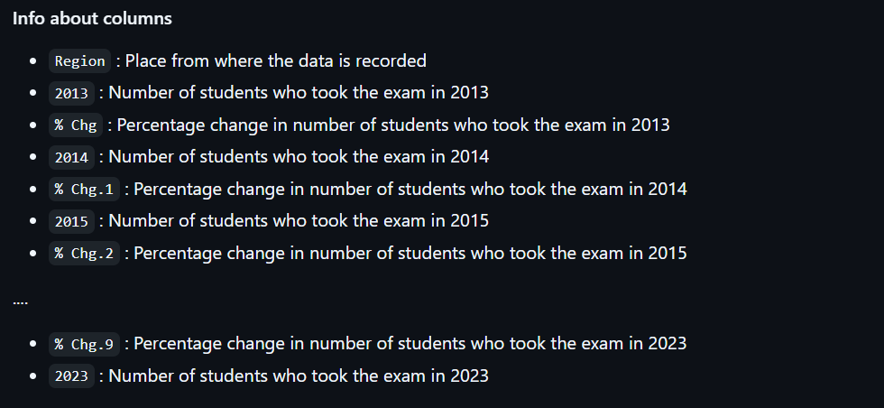
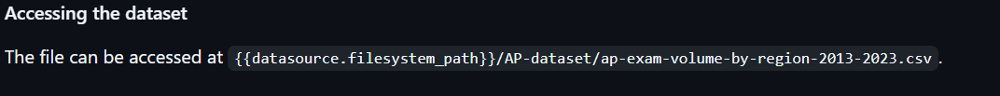
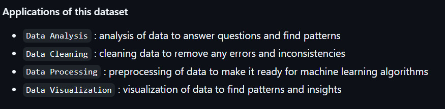
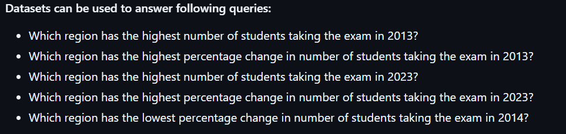
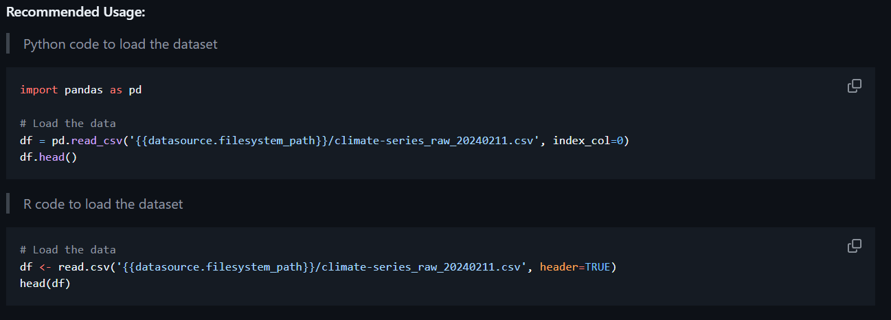
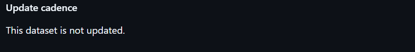
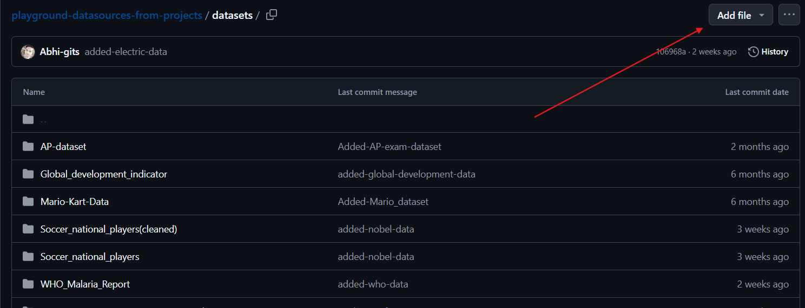
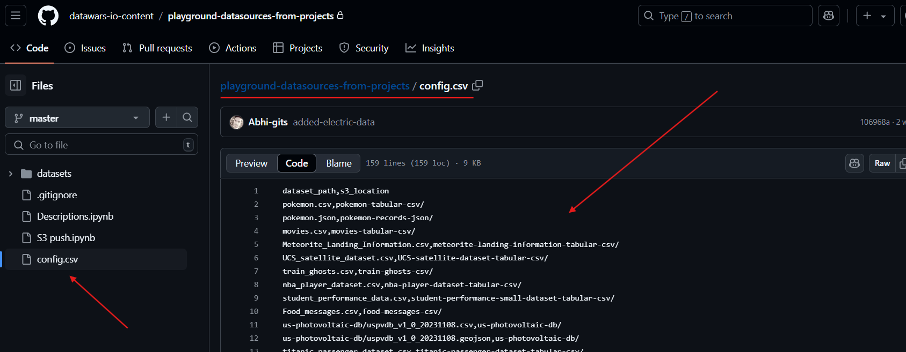

This page provides a step-by-step guide to creating datasets for Datawars playgrounds.

### Step 1: Finding datasets

#### Dataset can be found on various data sources. Here are the ways for finding datasources. Searce for repository with relevant keyword. There are public and government data repository that provide data of different domain. 

For exp: GBIF [Global Biodiversity Information Facility](https://www.gbif.org/what-is-gbif)—is an international network and data infrastructure aimed at providing anyone, anywhere, open access to data about biodiversity and all types of life on Earth. 

- **Academic Publications and Research Papers:** Reviewing relevant academic papers to identify potential data sources used by researchers in a particular field.
- **Industry Reports and Datasets:** Industry reports, whitepapers, or data published by companies or organizations related to the project theme. These might offer unique insights and datasets not readily available elsewhere.
- **Recent Events and Activities:** Utilize social media listening tools to identify relevant conversations and discussions happening online. Recent events like the country election[US Election], pandemic [Covid Dataset], etc. This can lead you to new data sources or user-generated content related to your topic.
- **Data Science Blogs and Communities:** Follow data science blogs, participate in online forums, and connect with other data scientists. This allows you to stay updated on new data repositories, emerging trends, and potential data sources shared by the community
- **Industry News and Publications:** Stay informed about industry news and publications related to your domain. Announcements about new data initiatives or collaborations might reveal fresh data sources

### Step 2: Extracting and processing datasets

Dataset can be downloaded from the source, in suitable format avilable like CSV, JSON, XML, etc. In next step, data files can be transformed into structured format such as CSV.

### Step 3: Writing dataset description

> Things to consider while writing dataset description:

* **Introduction:** Briefly introduce the dataset and the source from where it was obtained. Adding fact and figures about the dataset makes it look more interesting. Describe how the data was collected. This could be through surveys, experiments, observations, or other methods. Mention the source of the dataset. This could be a link to the original dataset or the name of the organization that provided the data.

* **`df.head()`** Adding preview of the dataset gives a brief idea about the dataset.


* **`df.info()`** : This method prints information about a DataFrame including the index dtype and column dtypes, non-null values, and memory usage.


* **Data path**: Mention the path of the dataset. This is important as it helps in locating the dataset easily.

- For data files with CSV file format, the path can be mentioned as follows: **{{datasource.filesystem_path}}/"filename"**
- For databases, the ip address path can be written as follows: **{{devices_copy."Data Source".ip_address}}**


* **Application of dataset:** Mention the possible application domains of the dataset. This helps in understanding the dataset better.


* **Dataset use example:** Mention the possible use case of the dataset.


* **Recommended use in Python or R language:** Mention the recommended usage of the dataset in Python or R language. This provides code to load file and preview.

* To read data file in python use the following code:

Dataset path is: **{{datasource.filesystem_path}}/"filename"**
```python
import pandas as pd
df = pd.read_csv('path_to_csv_file')    # Add csv filename
df.head()
```


* To access database tables in Python, use the following code:

Database path is: **{{devices."Data Source".ip_address}}**
```python
import pymysql.cursors

HOST = "{{devices."Data Source".ip_address}}" 
USER = "datawars"
DATABASE = "(database_name)"       # enter database name
PASSWORD = ""
PORT = 3306

# Create connection
conn = pymysql.connect(
    host=HOST, user=USER, port=PORT,
    password=PASSWORD, database=DATABASE,
    cursorclass=pymysql.cursors.DictCursor)

# Create cursor
cursor = conn.cursor()

# Execute query
cursor.execute("Your_query")    # enter your query here

# Fetch results
cursor.fetchall()
```

* **Update frequency:** Mention the frequency of the dataset update. This helps in understanding the dataset better.


> Note:
* Use markdown format for writing dataset description
* Add images to make the description more interactive
* Use `H3 markdown` format for writing headings

For Refrence to dataset description, here are some of the description file:
* for data files with csv format: [WHO Malaria Report 2023](https://github.com/datawars-io-content/playgrounds-datasources-descriptions.md/blob/main/WHO_Malaria_Report_2023.md)
* for databases: [Employees Database](https://github.com/datawars-io-content/playgrounds-datasources-descriptions.md/blob/main/Employees-mysql.md)

### Step 4: Uploading datasets to repositoy

* Dataset file of CSV format had to be uploaded to github repository [Github Repository](https://github.com/datawars-io-content/playground-datasources-from-projects)


* Dataset files must be stored in **dataset** folder only.
* Configuration of datafiles must be done in **config.csv** file.
* Syntax for configuration of datafiles in **config.csv** file: 


Syntax: 
```csv
filename,S3_path/
```

The dataset must be uploaded to the repository in the correct format and structure. This ensures that the dataset is easily accessible on datawars platform.