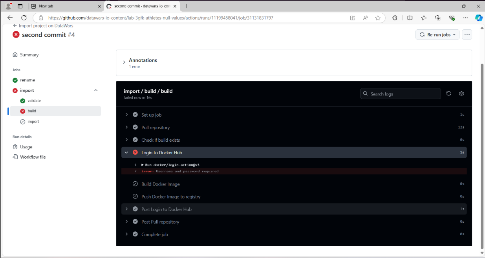
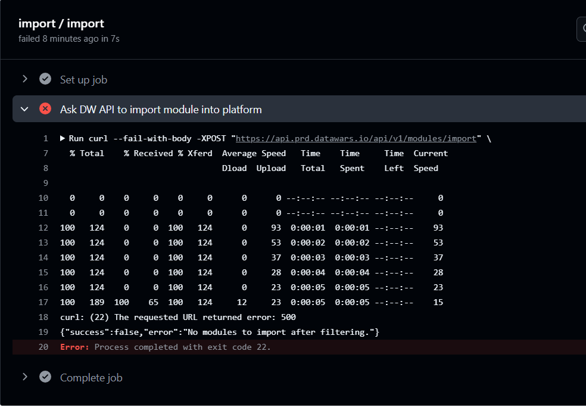

# FAQ: GitHub Actions

### 1. Docker username and password are not present
  
**Solution:**
This action's error occurs when the GitHub repository does not have the username and password secrets configured. 

To resolve this:
- Create a new repository.
- Move the content to the new repository.
- Ask [Anurag Verma](mailto:averma@datawars.io) to update the new repository in Airtable.

---

### 2. Import error: `{"success":false,"error":"'Skill Track'"}`

**Solution:**
This error occurs when a skill track or skill is missing in Airtable. 

To resolve this:
- Contact [Anurag Verma](mailto:averma@datawars.io) to add the missing skill track in the project on Airtable.

---

### 3. Import error: `{"success":false,"error":"No modules to import after filtering."}`
  
**Solution:**
This occurs because the repository of this project is not added to Airtable. 

To resolve this:
- Contact Anurag or Santiago to add the repository to the Airtable record.

---

### 4. Platform Showing No Content
  
**Solution:**
To display content on the platform:
- Ensure that the GitHub Action completes at least once.
- Wait for the actions to run fully and check back on the project.

---
