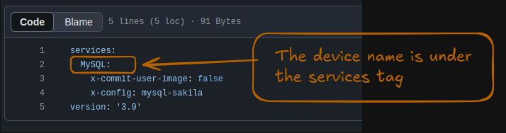

# FAQ: SQL

### 1. What will be the template for the SQL project?

**Solution:**
Use the SQL read-only template for SQL projects.

---

### 2. In the pandas project activity, we tested the assertions in the notebook. For the SQL project, what is the process to test the assertions?
**Solution:**
1. **Create a GitHub Repository:** Follow the instructions here: [Create a New Repo](https://datawars-io-content.github.io/project-author-documentation/new-authors-training/github/create-new-repo/).
2. **Update `docker-compose.yml`:** Modify the `docker-compose.yml` file according to the databases you’re using (refer to the GitHub repository creation documentation linked above).
3. **Share Your Repo:** Once ready, share your repository with Anurag to update Airtable.
4. **Build and Test Activities:**
   - Start creating the activities.
   - Push activities and test them directly on the platform to ensure functionality.

---

### 3. I got this image path error while importing.

**Solution:**
The path of the images directory is incorrect. Use:
- Correct: `images/img-1.png`
- Incorrect: `images\img-1.png`

---

### 4. I got this database-related error.
  
**Solution:**
For SQL activities, ensure that the database device name in the code snippets matches the name in `docker-compose.yml`.

Example:
- Device name in `docker-compose.yml`: `MySQL`

---
