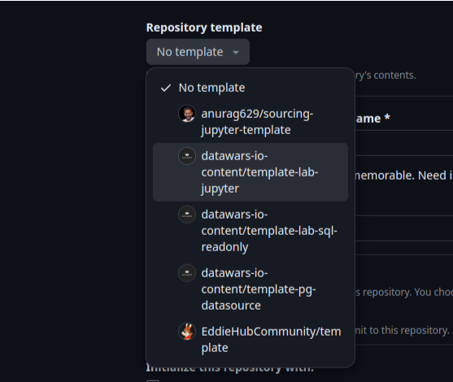
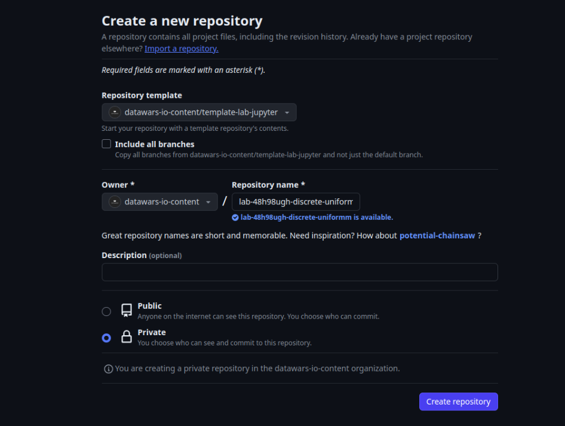
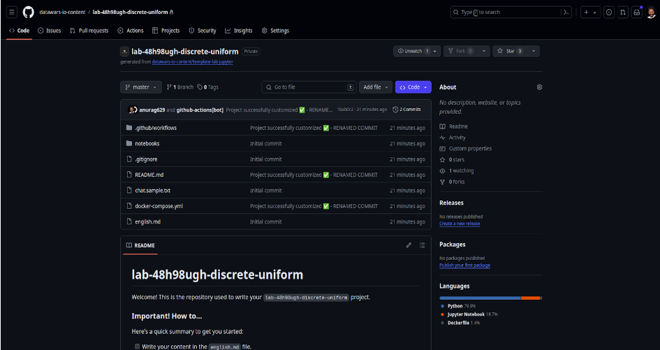

# Creating a new repository for your project

1. Create a new repository using the + sign.

2. Select the template

Depending on your project, you can choose jupyter template or the sql template.

3. Write the repository name

Format of the repository name: `lab-{random ID}-{project_name}`

* Random ID can be of any number and alphabets except special characters without any spaces.
* The project name should be in small case separated by `-` or `_` (dash or underscore).

> Example: `lab-1234-credit-card-fraud-detection` 

>    Make sure do not put any characters before `lab-` and after the project name.

4. Now, click on the Create repository button.

	This is how your repository looks.

    

> **Depending on the project, you can choose the template. For the SQL project, you can choose the SQL template.**

For your SQL projects, you have to setup the `docker-compose.yml` file. You can refer to the [Available Databases](https://github.com/datawars-io-content/reference-databases-available-sql-tracks) for the list of databases available. 

Check the `.yml` file in the repository and change the `docker-compose.yml` file according to the database you want to use.
